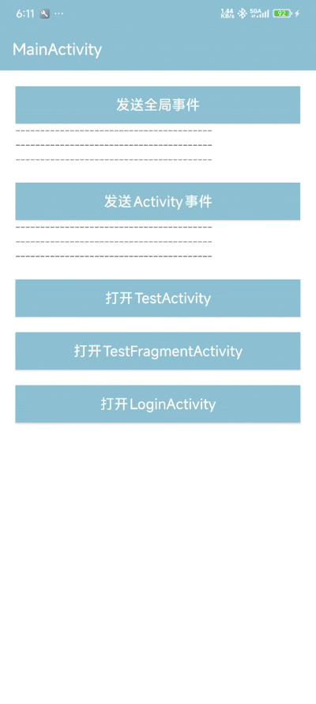

Chinese document [中文文档](./README.md)

# FlowBus

FlowBus is a Flow-first event framework built on Kotlin Coroutines / Flow.

It is designed for event broadcast, not for state management, and not as a replacement for direct function calls.

This repository contains two public modules:

- `flowbus-core`: platform-neutral core module
- `flowbus` (repository directory `library-android`): the recommended Android entry module

## What FlowBus is for

FlowBus fits well when your communication naturally looks like broadcast:

- screen A wants screen B to refresh without holding a direct reference
- a Fragment wants to notify its Activity to perform a UI action
- ViewModel / Repository / Worker code wants to notify UI asynchronously
- the same event should be received by multiple subscribers
- you want to consume events as `Flow` and compose them with other streams

Think of it as a broadcast system routed by event type or by named channels.

## What FlowBus is not for

These cases usually should not use FlowBus:

- page-local state management: prefer `StateFlow`
- explicit one-to-one calls: prefer direct function calls / use cases
- strict request-response: prefer return values, suspend functions, or dedicated channels
- long-lived shared state: prefer a state holder instead of transient events

A simple rule of thumb:

- “one place sends a notification and many places may react” → FlowBus may fit
- “A calls B and expects a result” → FlowBus is usually the wrong tool

## Which module should you choose first

### If you are building an Android app

Start with:

```gradle
implementation("io.github.logan0817:flowbus:<latest-version>")
```

Use it when you need:

- global event broadcast
- `ViewModelStoreOwner`-scoped events
- `eventFlow<T>()` / `owner.scopedEventFlow<T>()`
- reusable named handles with `eventChannel<T>("...")`
- lifecycle-safe collection through `collectEvent(...)` / `onEvent(...)`

Docs:

-  doc: [`library-android/README_EN.md`](./library-android/README_EN.md)

### If you need pure Kotlin / Coroutines / non-Android usage

Start with:

```gradle
implementation("io.github.logan0817:flowbus-core:<latest-version>")
```

Use it when you need:

- your own `FlowBus` instances
- root bus + scoped bus
- `FlowBusScope` lifecycle binding
- `EventKey`, `eventChannel(...)`, and sticky events
- non-Android runtime or your own upper-layer adapter

Docs:

doc: [`flowbus-core/README_EN.md`](https://github.com/logan0817/FlowBus/blob/main/library-android/README.md)

## Repository Layout

- The `FlowBus` repository continues to own the Android module, demo app, and integration-level development.
- `flowbus-core` now lives in its own repository and is mounted here as a git submodule.
- When cloning the main repository for the first time, use `git clone --recurse-submodules ...`, or run `git submodule update --init --recursive` in an existing checkout.

## Recommended onboarding path

1. Android users should start from [`library-android/README_EN.md`](./library-android/README_EN.md).
2. First remember the shortest path: send with `postEvent(...)`, receive with `onEvent<T> { ... }`.
3. If you need to know whether best-effort sending was accepted, use `tryPostEvent(...)` / `tryPostEventTo(...)`.
4. When events should stay inside an Activity / Fragment / NavBackStackEntry scope, move to the owner-based API.
5. When one payload type needs multiple semantic channels, introduce `eventChannel<T>("name")`.
6. Only move down to `flowbus-core` when you need multiple bus instances, explicit scope lifecycle, or non-Android usage.

## What is the relationship between `onEvent(...)` and `collectEvent(eventFlow(...))`

This is the most common source of confusion when reading the demo:

- the docs usually show `onEvent<T> { ... }`
- some demo pages use `collectEvent(eventFlow<T>()) { ... }`

They are not two different systems. They listen to the same event stream, but at different abstraction levels:

- `onEvent(...)`: the shortest UI-facing subscription API
- `eventFlow(...)` / `scopedEventFlow(...)` / `channel.flow()`: get the event as a `Flow` first
- `collectEvent(flow)`: collect any `Flow` with `LifecycleOwner` safety

For the simplest global event, these two can be understood as:

```kotlin
viewLifecycleOwner.onEvent<AddCartEvent> { event ->
    render(event)
}
```

```kotlin
viewLifecycleOwner.collectEvent(eventFlow<AddCartEvent>()) { event ->
    render(event)
}
```

The same mapping applies to owner-scoped events:

```kotlin
viewLifecycleOwner.onEvent<ReloadToolbarEvent>(from = requireActivity()) {
    renderToolbar()
}
```

```kotlin
viewLifecycleOwner.collectEvent(requireActivity().scopedEventFlow<ReloadToolbarEvent>()) {
    renderToolbar()
}
```

How to choose:

- if the page just needs to receive an event, use `onEvent(...)`
- if you want to `map`, `filter`, `debounce`, or `combine`, get the `Flow` first and use `collectEvent(...)`
- the demo intentionally shows both styles, so readers can understand both the shortest path and the “get Flow first” style

## 3-minute quick start

This is the shortest Android path and the best place for most first-time users to begin.

### 1. Define an event

```kotlin
data class RefreshHomeEvent(val source: String)
```

### 2. Send it

```kotlin
postEvent(RefreshHomeEvent(source = "login"))
```

### 3. Receive it

```kotlin
viewLifecycleOwner.onEvent<RefreshHomeEvent> { event ->
    viewModel.refreshFrom(event.source)
}
```

That is enough to start using FlowBus.

## The 4 most common scenarios

### Scenario 1: global refresh notifications

Good for:

- refreshing multiple screens after login succeeds
- notifying multiple observers when background sync finishes

```kotlin
data class SyncFinishedEvent(val successCount: Int)

postEvent(SyncFinishedEvent(successCount = 3))

viewLifecycleOwner.onEvent<SyncFinishedEvent> { event ->
    showResult(event.successCount)
}
```

### Scenario 2: Fragment notifies Activity

Good for:

- refreshing the toolbar
- asking Activity to navigate or show a dialog
- keeping communication inside the current screen tree instead of global scope

```kotlin
data object ReloadToolbarEvent

requireActivity().postScopedEvent(ReloadToolbarEvent)

viewLifecycleOwner.onEvent<ReloadToolbarEvent>(from = requireActivity()) {
    renderToolbar()
}
```

### Scenario 3: multiple named channels for the same payload type

Good for:

- `Toast`
- `SnackBar`
- navigation commands
- different meanings that all use `String`

```kotlin
val toastChannel = eventChannel<String>("ui.toast")

toastChannel.post("Saved")

viewLifecycleOwner.onEvent(toastChannel) { message ->
    showToast(message)
}
```

### Scenario 4: non-Android or lower-level scope control

Good for:

- Repository / Worker / Session isolation
- multiple bus instances
- scope lifecycle bound to `CoroutineScope` / `Job`

```kotlin
val syncScope = DefaultFlowBus.openScope("sync-task", closeWhen = scope)

syncScope.post(SyncProgress(percent = 10))

scope.launch {
    syncScope.flow<SyncProgress>().collect { progress ->
        render(progress)
    }
}
```

See [`flowbus-core/README_EN.md`](https://github.com/logan0817/FlowBus/blob/main/library-android/README.md) for details.

## API selection cheat sheet

| Need | Recommended API |
| --- | --- |
| Send globally | `postEvent(...)` |
| Know whether best-effort was accepted | `tryPostEvent(...)` |
| Guarantee delivery | `emitEvent(...)` |
| Send to an owner scope | `postEventTo(owner, ...)` / `owner.postScopedEvent(...)` |
| Named channel | `eventChannel<T>("name")` + `channel.post(...)` |
| Shortest one-line subscription | `onEvent(...)` |
| Get `Flow` first and compose it yourself | `eventFlow<T>()` / `owner.scopedEventFlow<T>()` |
| Lifecycle-safe collection of any `Flow` | `collectEvent(flow) { ... }` |
| Non-Android / multi-instance / scope lifecycle | `flowbus-core` |

### How to choose between `post` and `emit`

- `post*`: non-suspending, best-effort, shortest to write
- `tryPost*`: non-suspending and returns whether the current call was accepted
- `emit*`: suspends until delivery succeeds, better for critical events

### When to use sticky events

Good for:

- latest configuration
- latest initialization result
- the latest value that late subscribers should still see

Not good for:

- Toast
- navigation
- one-time click actions

### How to model events

Recommended order:

1. single action: `data class` / `data object`
2. multiple actions in one domain: `sealed interface` / `sealed class`
3. only use raw `String` / `Int` when the value is truly simple and obvious

If you put multiple child events into one channel via `sealed interface`, send them with the explicit parent type:

```kotlin
sealed interface MainUiEvent {
    data object Refresh : MainUiEvent
    data class ShowToast(val message: String) : MainUiEvent
}

postEvent<MainUiEvent>(MainUiEvent.Refresh)

viewLifecycleOwner.onEvent<MainUiEvent> { event ->
    when (event) {
        MainUiEvent.Refresh -> refresh()
        is MainUiEvent.ShowToast -> showToast(event.message)
    }
}
```

## Documentation map

- Android integration and scenarios: [`library-android/README_EN.md`](./library-android/README_EN.md)
- Core capabilities and multi-instance / scope usage: [`flowbus-core/README_EN.md`](https://github.com/logan0817/FlowBus/blob/main/library-android/README.md)
- Chinese document: [`README.md`](./README.md)

## Repository layout

- `flowbus-core`: core framework module
- `library-android`: Android adapter module
- `app`: demo app

## Demo



Downloadable [Demo APK](https://raw.githubusercontent.com/logan0817/FlowBus/master/app/apk/app-debug.apk) Experience.

The demo source lives in the [`app`](./app) module. A good reading order is:

1. `MainActivity`: global events, owner-scoped events, and the non-UI demo entry
2. `TestFragmentActivity`: Activity-scoped events, `eventChannel`, and shared receiving inside the same Activity owner scope from both Activity and Fragment
3. `LoginActivity`: owner-local bus demo

## License

```text
MIT License
```
